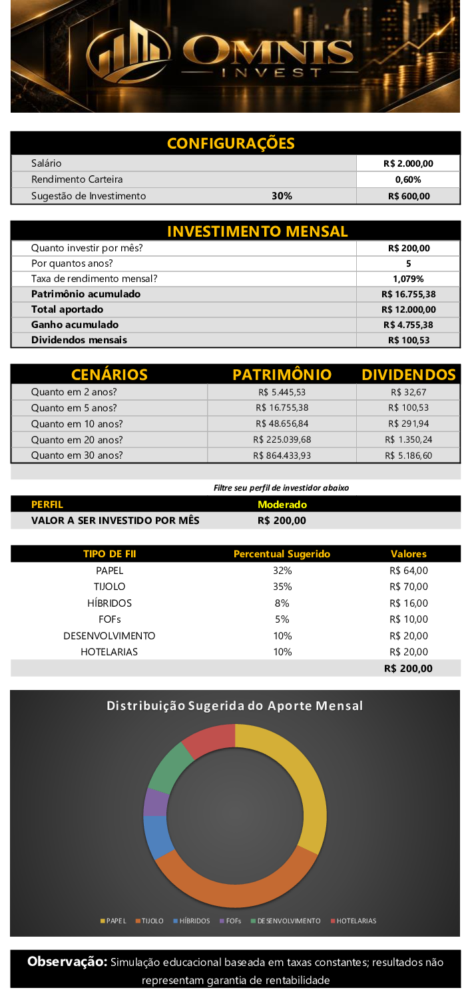

# OMNIS INVEST

Simulador de investimentos em Fundos Imobiliários desenvolvido em Microsoft Excel.

📥 [Baixar a planilha OMNIS INVEST](./omnis-invest.xlsx)

## Sobre o projeto

O **OMNIS INVEST** é um simulador de investimentos em Fundos Imobiliários (FIIs) desenvolvido em Microsoft Excel.

A ferramenta permite configurar parâmetros como salário, percentual destinado a investimentos, aporte mensal, período de investimento e taxa de rendimento. A partir dessas informações, a planilha calcula automaticamente o patrimônio acumulado, o total aportado, o ganho acumulado e uma estimativa de dividendos mensais.

O projeto também permite selecionar um perfil de investidor e apresenta uma sugestão de distribuição do aporte entre diferentes tipos de FIIs, acompanhada de uma visualização gráfica.

## Funcionalidades

- Simulação de investimentos a partir de aporte mensal, período e taxa de rendimento
- Cálculo automático do patrimônio acumulado
- Comparação entre total aportado e ganho acumulado
- Estimativa de dividendos mensais
- Projeção de patrimônio e dividendos para diferentes períodos
- Seleção do perfil de investidor: Conservador, Moderado ou Agressivo
- Sugestão automática de distribuição do aporte entre diferentes tipos de FIIs
- Visualização gráfica da distribuição sugerida do investimento

## Tecnologias e recursos utilizados

O projeto foi desenvolvido no **Microsoft Excel**, utilizando recursos como:

- Fórmulas e cálculos automatizados
- Função financeira `FV` para projeção do patrimônio
- `VLOOKUP (PROCV)` para busca de dados na tabela auxiliar
- Intervalos nomeados para organização e leitura das fórmulas
- Referências absolutas para construção dos cenários de investimento
- Validação de dados para seleção de parâmetros e perfil de investidor
- Formatação condicional para feedback visual do perfil selecionado
- Gráfico de rosca para visualização da distribuição sugerida do aporte

## Como utilizar

1. Baixe o arquivo `omnis-invest.xlsx` disponível neste repositório.
2. Abra o arquivo no Microsoft Excel.
3. Na seção **Configurações**, informe o salário e escolha o percentual que deseja destinar aos investimentos.
4. Na seção **Investimento Mensal**, defina o aporte, o período de investimento e a taxa de rendimento mensal.
5. Consulte os resultados calculados automaticamente, como patrimônio acumulado, total aportado, ganho acumulado e dividendos mensais.
6. Selecione seu perfil de investidor para visualizar a sugestão de distribuição do aporte entre os diferentes tipos de FIIs.
7. Consulte o gráfico para visualizar a composição sugerida do aporte mensal.

## Principais aprendizados

Durante o desenvolvimento do OMNIS INVEST, pude aplicar conceitos de Excel em um projeto prático e compreender melhor como diferentes recursos podem trabalhar em conjunto dentro de uma mesma solução.

Entre os principais aprendizados estão:

- Estruturação de uma planilha separando dados de entrada, cálculos e resultados
- Uso de fórmulas financeiras para criação de projeções
- Aplicação de funções de busca para relacionar informações de uma tabela auxiliar
- Uso de intervalos nomeados para tornar fórmulas mais organizadas e compreensíveis
- Criação de campos controlados por validação de dados
- Aplicação de formatação condicional para fornecer feedback visual ao usuário
- Construção de visualizações a partir dos resultados calculados
- Importância da organização visual e da experiência de uso em uma ferramenta desenvolvida no Excel

## Aprimoramentos realizados

Após a construção da versão inicial do simulador, o projeto foi revisado e aprimorado para a publicação no portfólio.

Entre os aprimoramentos realizados estão:

- Criação da identidade visual **OMNIS INVEST**
- Reorganização visual da interface para facilitar a leitura das informações
- Inclusão dos indicadores de **Total Aportado** e **Ganho Acumulado**
- Melhoria da apresentação dos cenários de patrimônio e dividendos
- Inclusão de validação de dados para seleção do percentual destinado aos investimentos
- Melhoria da seleção do perfil de investidor com instruções e feedback visual por formatação condicional
- Criação do gráfico **Distribuição Sugerida do Aporte Mensal**
- Refinamento da apresentação das categorias e valores da distribuição sugerida
- Inclusão de aviso informando que os resultados são simulações baseadas em taxas constantes e não representam garantia de retorno

## Origem do projeto

Este projeto foi iniciado a partir de um desafio da formação **Análise de Dados com Excel e IA**, da **DIO**, cujo objetivo era desenvolver um simulador de investimentos em Fundos Imobiliários utilizando o Microsoft Excel.

A partir da proposta apresentada durante a formação, o projeto foi desenvolvido, personalizado e posteriormente aprimorado para compor meu portfólio de projetos em análise de dados.

A versão apresentada neste repositório incorpora identidade visual própria, novos indicadores, validações, melhorias na experiência de uso e visualização gráfica dos resultados.

## Aviso

> **Este projeto possui finalidade exclusivamente educacional.** Os cálculos e projeções apresentados utilizam parâmetros e taxas informados pelo usuário e não representam recomendação de investimento ou garantia de rentabilidade.
